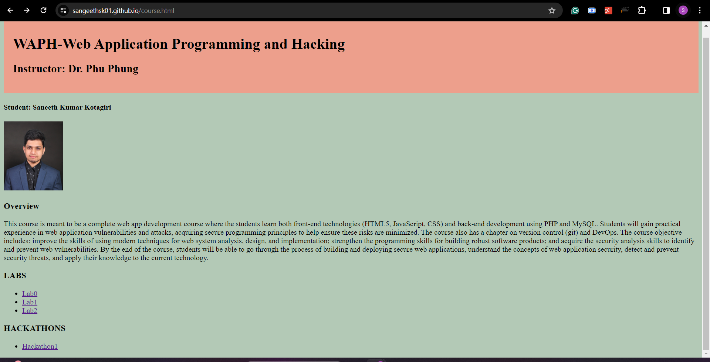
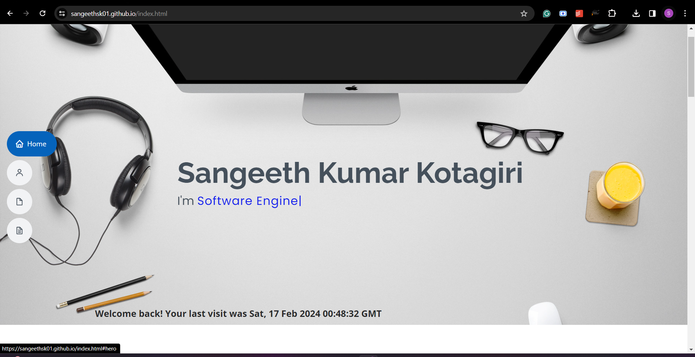
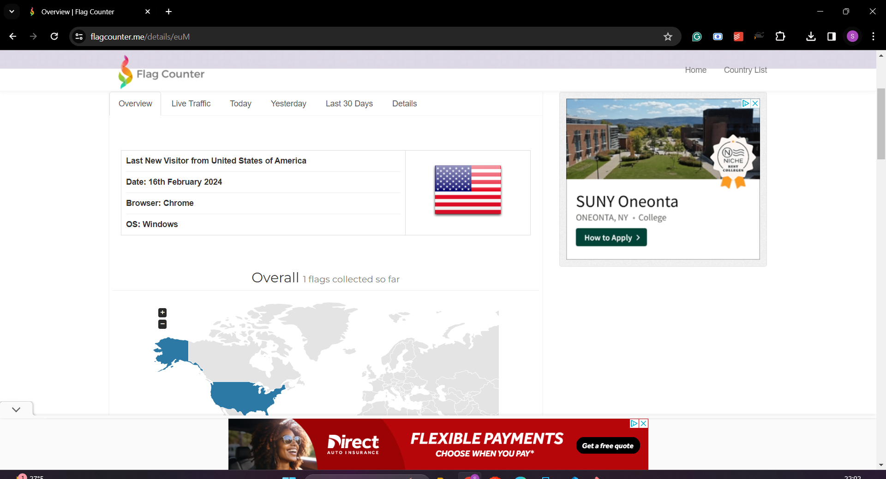
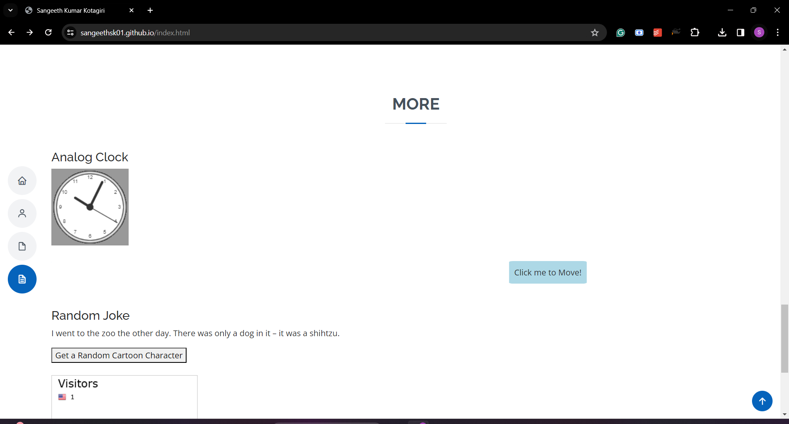
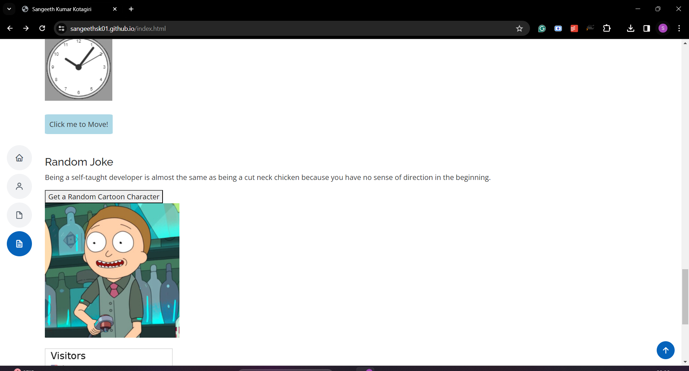

# WAPH-Web Application Programming and Hacking
# Individual Project 1
## Front-end Web Development with a Professional Profile Website on github.io cloud service

## Instructor: Dr. Phu Phung
## Student
**Name**: Sangeeth Kumar Kotagiri 


**Email**: kotagisr@mail.uc.edu 


**Short-bio**: I am an IT graduate student at UC. I am interested in backend development and AI. 

 
 


## Repository Information 

**Repository URL**: https://github.com/Sangeethsk01/Sangeethsk01.github.io 


## Project Overview
The project involves creating a personal website hosted on GitHub. The website includes an index.html file displaying personal information, skills, and a resume. A separate course.html file links to labs and hackathons. The site uses an open-source Bootstrap template with features like scroll animation, navigation bar, and reload effects. A page tracker using Flagcounter counts visitors. Technical features include a jQuery analog clock, a digital clock, and a show/hide email function. The project integrates a joke API for displaying jokes, a Rick and Morty API for random cartoon characters, and utilizes JavaScript cookies to show a welcome message for new and returning visitors. Overall, I learned how to host a static webpage on github.io and design it with css and bootstrap. I also learned about javascript libraries and how cookies work.

Link to the `github.io` repository: [https://github.com/Sangeethsk01/Sangeethsk01.github.io/tree/main](https://github.com/Sangeethsk01/Sangeethsk01.github.io/tree/main) 

Link to the portfolio webpage: [https://sangeethsk01.github.io/index.html](https://sangeethsk01.github.io/index.html)

## Task 1: General Requirements
- Created an index.html file to display my information including my name, headshot, skills, and resume. Hosted this page as a personal website on my GitHub cloud account under the name `Sangeethsk01.github.io`.

  

   
- Created another file named course.html that introduces this course and provides the links to all the labs and hackathons I completed. Provided this file as a link in the personal website page in the 'About' section.


  

## Task 2: Non-technical requirements
- I have used an open-source bootstrap template and CSS library to design this portfolio. The page contains features like the animation on scroll (aos), navigation bar, reload effects, etc.


  
 
  
- Included a page tracker using `flagcounter` to count the number of visitors to the page. Included this counter at the bottom of the page.

  
  
  Page Tracker:
  ```html
   <!--Flag counter to count visitors-->
    <div class="Counter">
      <a href="https://www.flagcounter.me/details/euM">
      </a>
    </div>
  ```

  
## Task 3: Technical requirements
### Javascript frameworks
- Used jQuery to implement an analog clock in the 'more' section and a digital clock, a show/hide email function in the 'about' section.

  


- Used javascript open source library 'anime' library to create animation by making a button move when clicked on it. Used an EventListner to achieve this.
  Animation code:
  ```html
   <div id="animatedElement">Click me to Move!</div>
   <script>
          // Using JS Animation library to move an element
          const element = document.getElementById('animatedElement');
          // Add a click event listener to trigger the animation
           element.addEventListener('click', () => {
          anime({
          targets: element,
          translateX: 1000,
          easing: 'easeInOutQuad',
          duration: 1000,
          direction: 'alternate',
            });
          });
   </script>
  ```
  
### API Integration
- Included the public jokeAPI to display a new joke every one minute. Used Ajax function to send the API get request.

  
  Code:
  ```html
  <div id="jokeContainer">
        <!-- The joke will be displayed here -->
   </div>
   <script>
        // Function to fetch and display a joke
        function fetchJoke() {
            $.ajax({
                url: 'https://v2.jokeapi.dev/joke/Any',
                method: 'GET',
                success: function(response) {
                    // Check if it's a single-part or two-part joke
                    var jokeText = response.type === 'single' ?
                    response.joke : response.setup + ' ' + response.delivery;

                    // Display the joke in the container
                    $('#jokeContainer').html('<p>' + jokeText + '</p>');
                },
                error: function(error) {
                    console.error('Error fetching joke:', error);
                }
            });
        }

        // Initial fetch when the page loads
        fetchJoke();

        // Set up interval to fetch and display a joke every minute
        setInterval(fetchJoke, 60000);
   </script>
  ```


     
- Used a public API named `rickandmortyapi` to get cartoon characters when requested. Built a function to generate a random number to get a random character when clicked on the button.

  Code:
  ```html
   <button id="getRandomCharacter">Get a Random Cartoon Character</button>
    <div id="characterImage">
        <!-- Character image will be displayed here -->
    </div>
   <script>
    //Generating Rick and morty cartoon characters
        $("#getRandomCharacter").click(function(){
            getRandomCharacter();
        });

        function getRandomCharacter() {
            $.ajax({
                url: 'https://rickandmortyapi.com/api/character/' +
                      getRandomCharacterId(),
                method: 'GET',
                success: function(response) {
                    displayCharacterImage(response);
                },
                error: function(error) {
                    console.error('Error fetching character:', error);
                }
            });
        }

        function getRandomCharacterId() {
            // The Rick and Morty API has characters up to id 671, adjust as needed
            return Math.floor(Math.random() * 671) + 1;
        }

        function displayCharacterImage(character) {
            var characterImage = '';
            $("#characterImage").html(characterImage);
        }
   </script>
  ```
### Using JavaScript cookies
- Using a cookie, written a Javascript code to display a welcome message for the new visitors and a welcomeback message for the old visitors on the home section. The JavaScript code includes two functions for handling cookies in the web browser. The setCookie function sets a cookie with a given name, value, and optional expiration period in days. The getCookie function retrieves the value of a specified cookie by searching through the document's stored cookies.

  Code:
  ```html
   <strong><div class="cookie" id="welcomeMessage"></div></strong>
    <script>
      // Cookie code
       function setCookie(name, value, days) {
            var expires = "";
            if (days) {
                var date = new Date();
                date.setTime(date.getTime() + (days * 24 * 60 * 60 * 1000));
                expires = "; expires=" + date.toUTCString();
            }
            document.cookie = name + "=" + value + expires + "; path=/";
        }

        function getCookie(name) {
            var nameEQ = name + "=";
            var cookies = document.cookie.split(';');
            for (var i = 0; i < cookies.length; i++) {
                var cookie = cookies[i];
                while (cookie.charAt(0) == ' ') {
                    cookie = cookie.substring(1, cookie.length);
                }
                if (cookie.indexOf(nameEQ) == 0) {
                    return cookie.substring(nameEQ.length, cookie.length);
                }
            }
            return null;
        }

        function displayWelcomeMessage() {
            var lastVisit = getCookie("lastVisit");
            var welcomeMessage = $("#welcomeMessage");

            if (lastVisit === null) {
                // First-time visit
                welcomeMessage.text("Welcome to my homepage!");
                setCookie("lastVisit", new Date().toUTCString(), 365); 
            } else {
                // Returning visit
                welcomeMessage.text("Welcome back! Your last visit was " + lastVisit);
            }
        }

        // Call the function when the document is ready
        $(document).ready(function(){
            displayWelcomeMessage();
        });
    </script>
  ```


   
